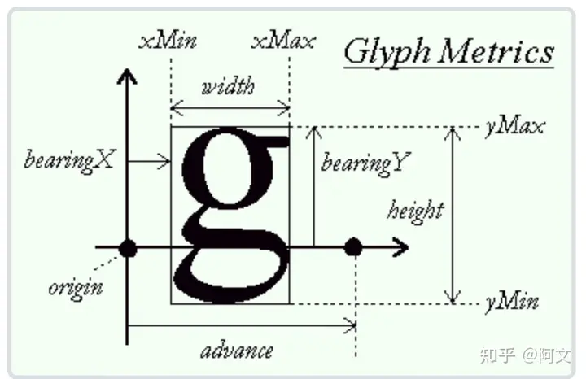

# 历史

# TextMeshPro
## TMP_FontAsset
- FaceInfo  
   1. Family Name: 字体资源的名字
   2. Style Name: 风格的名字,例如Bold,Italic..
   3. Point Size: 字体大小,会写入到图集中
   4. Scale: 字体缩放大小
   5. Line Height: 设置行间距
   6. Ascent Line: 
- Font Weights  
   作用: 主要是用来控制字体的粗细和斜体程度,由两种方式来控制,按顺序查找,只有1中没有重写字体时,才会使用第二种
     1. 把程度分为不同档次,例如thin,bold, 通过在不同的档次中设置一个字体来实现
     2. 通过数值来模拟粗细的不同程度,例如Normal Weight,Bold Weight是用来设置粗细程度,Italic Style用来设置斜体的程度  
   1. Normal Weight
   2. Bold Weight
   3. Spacing Offset: 每个字符之间的距离
   4. Bold Spacing: 使用Bold风格时每个字符之间的距离
   5. Italic Style:
   6. Tab Multiple: 制表符等于多少空格

- Fallback Font Assets
   作用: 如果没有找到该字体资源的话,遍历这个字体列表知道找到,但是搜索会发生一些计算消耗
  
- Character Table & Glyph Table  
  概述: 一起讲这两个是因为他们具有关联性,Character Table中的GlyphId会映射到Glyph Table,Character Table中包含Unicode,Glyph Id,Scale字段,Glyph Table中包含了每个字形信息
    1. Glyph Rect(X,Y,Width,Height):用来定位图集中该文字的位置
    2. Glyph Metrics  
        - Weight & Height: 会直接反映在显示上的宽高,Rect的宽高只是获取文字的位置,显示上会被Metrics的宽高缩放,所以通常他们的值相等
        - BX(BearingX) & BY(BearinigY): 见图
        - AD(Advance)步进: 见图
        
        
    3. Glyph Adjustment Table
        作用: 为指定的字符对增加一些信息
        1. OX(Offset X) & OY(Offset Y): 设置字符的偏移值,只在相应的字符对中才生效
        2. AX(Advance X): 类似上述

   
## TTF字体

## FontAsset Creater

# Text

# Text和TextMeshPro的区别: