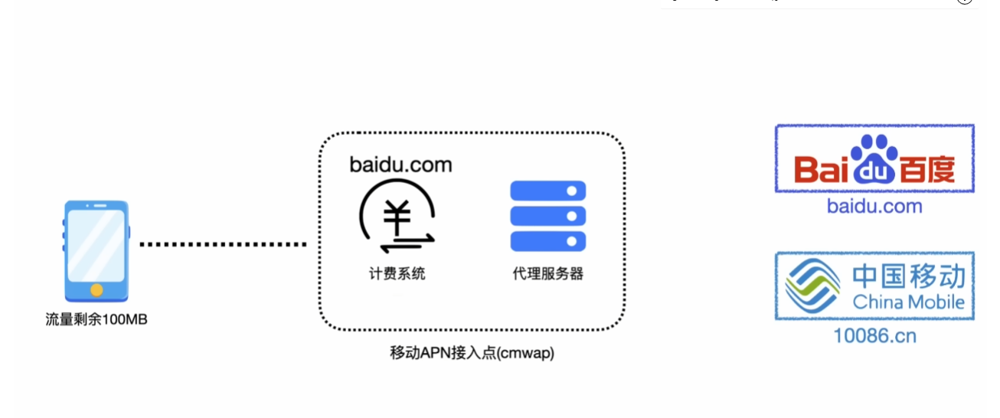

# 本地免流

现在已经被淘汰,原理是流量从手机发出后会到达运营商的APN(Access Point Name,网关名称,移动网络必须接入到运营商给的网关接入点才能连接到计算机网络(通常是互联网)),APN会有计费系统,APN会去查找请求头中的Host或者X-Online-Host,如果网站符合免流,那直接进入代理服务器,代理服务器也使用Host或者X-Online-Host去请求数据,这就可能出现 计费系统使用Host,代理服务器使用X-Online-Host,所以我们就可以通过本地Http代理修改Host,或者X-Online-Host来实现免流。当时能该的地方也就这么几个,所以很快被修复了。
# 云免流
- 定向免流 
   原理: 类似腾讯王卡之类的都做了对一些服务的免费流量,例如腾讯视频,那我们可以通过域名伪装的方式来欺骗服务器,搭建一个VMess服务器,将伪装地址改成免流地址,但Ip还是我们的VMess服务器,最终流量还是到了我们的服务器,即实现了翻墙,又实现了免流

- 直连免流  
   原理: 主要是对于像使用腾讯浏览器免流所有网址,腾讯浏览器中内置了一个代理服务器,通过代理服务器发送出去的网址都能够免流

- 停机免流  
  原理: 停机之后运营商会开启一个访问类似充值网站的绿色通道,和定向免流是一个道理,将Host请求改成指定网址,访问我们搭建的VMess服务器即可